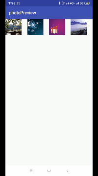

# photoView
仿微信浏览大图移动缩放

# 效果图


# 使用，项目目前使用的是kotlin语言，后期会加上java版的

## 引用第三方library
[PhotoView](https://github.com/chrisbanes/PhotoView/)

## java代码使用
```kotlin
val dialog = PhotoViewDialog.newInstance(list, position).apply {
                        // targetView是点击需要预览的ImageView，必须设置
                        targetView = holder.itemView
                        // 预览图片回调
                        onPhotoPreviewListener = object : PhotoViewDialog.OnPhotoPreviewListener {
                            override fun onPhotoPreview(index: Int): View? {
                            // index 预览图片position,这里必须返回当前正在预览的图片
                                return imageView
                            }
                        }
                    }
                    val activity = context as AppCompatActivity
                    dialog.show(activity.supportFragmentManager, null)
```
